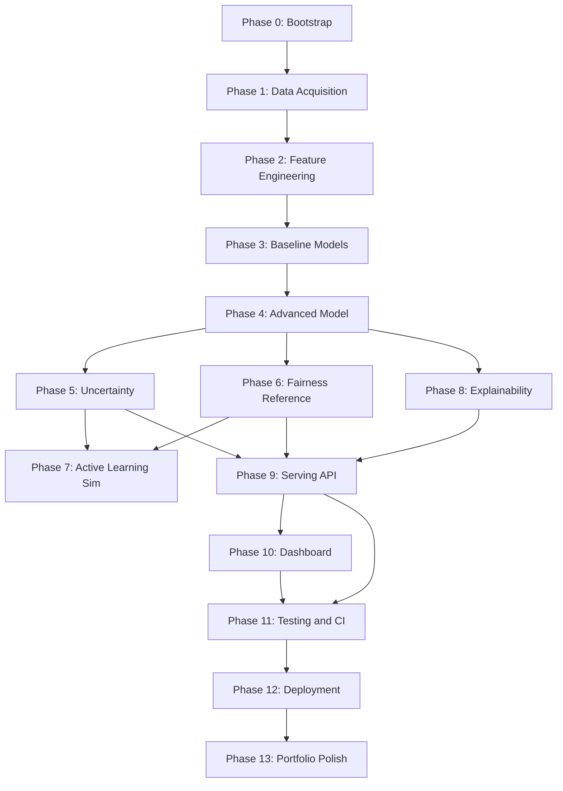

# LeadGuard — Agentic Implementation Specification

**Version:** 1.0
**Date:** August 20, 2026
**Audience:** An autonomous or semi-autonomous coding agent (e.g. Claude Code) implementing this repository with minimal human intervention.
**Companion document:** `LeadGuard_Architecture.md` — the schemas, formulas, and contracts referenced throughout this spec are defined there, not repeated here. Read it first.

---

## 0. How To Use This Document

You are implementing LeadGuard end to end. Rules for how you work, not just what you build:

1. Read this entire document and `LeadGuard_Architecture.md` before writing any code. Do not start Phase 0 having only skimmed the phase you think you're on.
2. Work through phases **in order**. Phase N's preconditions assume every earlier phase's acceptance criteria already passed. Do not jump ahead because a later phase looks easier or more interesting.
3. Every phase ends with a **self-verification** step. You may not mark a phase complete, move to the next phase, or report success to the human until the verification command(s) for that phase pass. If they don't pass, fix the phase — don't weaken the acceptance criteria to make it pass.
4. Maintain `PROGRESS.md` at the repo root. Append one entry per completed phase using the template in §11. This is your own audit trail and the human's primary way of following your work without re-reading a diff.
5. Respect the **human checkpoints** in §8 exactly. These are the only points where you stop and wait rather than proceeding autonomously.
6. If an acceptance criterion cannot be met after two genuine attempts, stop. Write a blocker entry in `PROGRESS.md` explaining what you tried and why it failed, and wait for human input. Do not silently lower a threshold (e.g., changing ">0.70 PR-AUC" to ">0.55 PR-AUC") to make a phase "pass."
7. Never violate a constraint in §2 even if a later instruction seems to imply it's fine. If you notice a conflict between this spec and something that would violate §2, flag it in `PROGRESS.md` and stop rather than resolving the conflict yourself.

---

## 1. Mission

Build LeadGuard: a CPU-only, $0-infrastructure system that predicts lead service line material, quantifies uncertainty, ranks properties for inspection under a budget and equity constraint, and explains every prediction. Full design is in `LeadGuard_Architecture.md`. Your job is to turn that design into a working, tested repository.

---

## 2. Hard Constraints — Never Violate These

- **No paid services.** No API keys that cost money, no paid cloud compute, no paid database, no paid model APIs. If a task seems to need one, find the free/OSS alternative or stop and flag it.
- **CPU-only critical path.** The system must fully train and serve on a CPU-only machine. GPU code (if you write any for the optional ablation) must be behind a flag and never required for the main pipeline to run.
- **No PII beyond public property records.** Do not add scraping of any non-public source. Do not log full addresses in plaintext application logs (hash or truncate).
- **No demographic fields in the training feature matrix.** `income_quartile` and any census-derived field may only appear in `fairness_reference.parquet` and the fairness-audit code path (`evaluation/fairness.py`). If you find yourself about to add one to `features.py`, stop — that's the one line in this whole spec you must never cross regardless of what seems locally convenient.
- **Every pipeline stage validates its own output** against a schema (Pandera) before writing it to disk. A stage that writes unvalidated data is not done, no matter how correct it looks.
- **Every module you write gets a test.** No exceptions for "small" utility functions.
- **Total repo size (excluding `.git`) stays under 2GB.** Check with `du -sh .` before considering any phase involving data or models complete.

---

## 3. Environment Bootstrap

Run once, at the very start of Phase 0.

```bash
python3 --version                     # must be 3.11.x — if not, stop and flag it
python3 -m venv .venv
source .venv/bin/activate
pip install --upgrade pip
pip install -e ".[dev]"               # once pyproject.toml exists (Phase 0 task)
python -c "import xgboost, sklearn, shap, mapie, h3, geopandas, fastapi, streamlit; print('OK')"
nproc                                  # confirm available cores for training config
```

If any import fails, resolve it before proceeding — do not comment out the failing import and continue.

---

## 4. Global Conventions

| Area | Rule |
|---|---|
| Style | `black` + `ruff`, both run in a pre-commit hook and in CI. Line length 100. |
| Typing | Type hints on every function signature. `mypy` runs in CI in non-blocking (warn-only) mode for v1. |
| Docstrings | Google style, on every public function/class. |
| Tests | `pytest`. One test file per module minimum: `tests/unit/test_<module>.py`. Every pipeline stage additionally gets a smoke test in `tests/integration/` that runs it against `data/sample/`. |
| Config | No hardcoded paths, hyperparameters, or magic numbers in source files. Everything tunable lives in `configs/*.yaml`, loaded via `pydantic-settings`. |
| Randomness | `SEED = 42` as a single constant in `src/leadguard/utils/seed.py`, imported everywhere randomness occurs. |
| Logging | Standard `logging` module, structured (module name + level + message). No bare `print()` in `src/` or `api/`. |
| Commits | Conventional commits (`feat:`, `fix:`, `test:`, `docs:`, `chore:`). One logical change per commit — do not bundle Phase 3 and Phase 4 work into a single commit. |

---

## 5. Phase Dependency Map



**The one ordering choice that differs from the original 8-week plan:** Phase 6 (Fairness Reference) must complete before Phase 7 (Active Learning), because the active learning priority score consumes `equity_boost`, which is computed from the fairness reference table (`LeadGuard_Architecture.md` §7.4–7.5). Building the active learning loop first and bolting on fairness after would mean re-deriving the scoring function later — build it in the right order the first time.

---

## 6. Phased Build Plan

Each phase below follows the same structure: Goal, Preconditions, Tasks, Files, Acceptance Criteria, Self-Verification.

### Phase 0 — Environment & Scaffolding

**Goal:** A repository that installs cleanly and does nothing yet, but does "nothing" correctly.

**Preconditions:** None — this is the starting phase.

**Tasks:**
1. Create the full directory tree from `LeadGuard_Architecture.md` §12.
2. Write `pyproject.toml` with all dependencies from Architecture §11, pinned to major version at minimum.
3. Write `Makefile` with targets: `install`, `test`, `lint`, `format`, `train`, `serve`, `dashboard`, `clean`.
4. Write `.env.example`, `.gitignore` (must exclude `data/raw/`, `data/interim/`, `models/*.pkl`, `mlruns/`, `__pycache__/`, `.venv/`).
5. Write `configs/train.yaml`, `configs/features.yaml`, `configs/scoring.yaml` with the defaults named in the Architecture doc (`λ1=0.60, λ2=0.25, λ3=0.15`, `confidence_level=0.90`, XGBoost hyperparameters from §7.2).
6. Set up `pre-commit` with `black`, `ruff`.
7. Set up `.github/workflows/ci.yml` (can be minimal for now — lint + a placeholder test — full CI content comes in Phase 11).

**Files:** Everything in Architecture §12 except `src/leadguard/*` implementation files (empty `__init__.py`s only for now).

**Acceptance criteria:**
- `pip install -e ".[dev]"` succeeds from a clean venv.
- `make lint` runs and passes (or fails only on files that don't exist yet).
- `pre-commit run --all-files` succeeds.

**Self-verification:**
```bash
make lint && echo "PHASE 0 PASS"
```

---

### Phase 1 — Data Acquisition & Validation

**Goal:** Raw public data downloaded, cleaned, and schema-validated into `data/interim/`.

**Preconditions:** Phase 0 complete.

**Tasks:**
1. Implement `src/leadguard/data/download.py`: fetches the four sources in Architecture §6.1. Idempotent — checks a checksum/manifest before re-downloading.
2. Define Pandera schemas for each raw source in `src/leadguard/data/validation.py`.
3. Implement `src/leadguard/data/clean.py`: dedupe on `property_id`, normalize addresses, join Cook County assessor data onto the water-service-line table, validate against the Pandera schema, write to `data/interim/`.
4. Create `data/sample/` — a fixed 5,000–10,000 row sample (seeded, stratified to keep some of every material class) for CI and fast iteration. Commit this to git; it's small and de-identified enough to be safe.
5. Write a data card (`docs/data_card.md`): row counts, missingness rates per field, class balance, known quality issues (the ~15% missing-material rate, geocoding error rate if measurable).

**Files:** `src/leadguard/data/{download,clean,validation}.py`, `data/sample/*.parquet`, `docs/data_card.md`.

**Acceptance criteria:**
- `python -m leadguard.data.clean` run against the sample produces a Pandera-valid `interim` file with zero duplicate `property_id`s.
- Data card documents at minimum: total properties, % with known material, % missing `year_built`, class balance of `service_line_material`.
- Re-running `download.py` a second time makes zero new network requests (idempotency check).

**Self-verification:**
```bash
python -m leadguard.data.clean --input data/sample --output /tmp/interim_check.parquet
python -c "
import pandas as pd
df = pd.read_parquet('/tmp/interim_check.parquet')
assert df['property_id'].is_unique, 'duplicate property_id found'
print('PHASE 1 PASS')
"
```

---

### Phase 2 — Feature Engineering

**Goal:** `features.parquet` matching the `Property` schema in Architecture §6.2, with leakage-safe spatial features.

**Preconditions:** Phase 1 complete.

**Tasks:**
1. Implement `src/leadguard/utils/geospatial.py`: H3 indexing at resolutions 8 and 9, distance-to-nearest-hydrant, distance-to-nearest-known-lead.
2. Implement `src/leadguard/data/features.py`: joins OSM-derived geospatial features onto the interim table; computes `neighbor_lead_rate_h3res8` and `knn10_lead_rate` — **compute these only from the training partition inside each CV fold or holdout split, never from the full dataset before splitting.** This is the single most common way this exact feature type leaks; get it right here or every downstream metric is inflated.
3. Add a fold-aware wrapper so the same spatial-lag computation is reusable both for the geographic holdout (§Phase 4) and for k-fold CV.
4. Validate output against the `Property` Pandera schema, explicitly asserting `census_tract` is present but confirming (via a test) that no income/race-derived column exists in this table.

**Files:** `src/leadguard/utils/geospatial.py`, `src/leadguard/data/features.py`.

**Acceptance criteria:**
- Output schema matches Architecture §6.2 `Property` entity exactly (field names and types).
- `test_no_demographic_leakage` (Architecture §10) passes: no column in `features.parquet` is income- or race-derived.
- A leakage regression test confirms `neighbor_lead_rate_h3res8` computed on a train fold does not use any row from the corresponding held-out fold.

**Self-verification:**
```bash
pytest tests/unit/test_features.py tests/unit/test_no_demographic_leakage.py -v
```

---

### Phase 3 — Baseline Models

**Goal:** Three baselines (heuristic, logistic regression, random forest) trained and scored, establishing the bar Phase 4 must clear.

**Preconditions:** Phase 2 complete.

**Tasks:**
1. Implement `src/leadguard/models/baseline.py` with all three baselines from Architecture §7.2.
2. Implement the geographic holdout split (entire wards excluded from training) alongside a random split, both in `src/leadguard/evaluation/metrics.py`.
3. Score all three baselines on both splits; write results to `reports/baseline_metrics.json`.

**Files:** `src/leadguard/models/baseline.py`, `src/leadguard/evaluation/metrics.py`, `reports/baseline_metrics.json`.

**Acceptance criteria:**
- All three baselines produce a PR-AUC and F2 score on both the random and geographic split.
- Random forest PR-AUC is recorded — this number is the gate Phase 4 must beat by >10% relative.

**Self-verification:**
```bash
python -m leadguard.models.baseline --config configs/train.yaml
python -c "
import json
m = json.load(open('reports/baseline_metrics.json'))
assert 'random_forest' in m and 'pr_auc_geo' in m['random_forest']
print('PHASE 3 PASS —', m['random_forest']['pr_auc_geo'])
"
```

---

### Phase 4 — Advanced Model (XGBoost + Geospatial)

**Goal:** XGBoost model beating the Phase 3 baseline gate, with hyperparameter search and monotonic constraints.

**Preconditions:** Phase 3 complete, baseline PR-AUC recorded.

**Tasks:**
1. Implement `src/leadguard/models/xgboost_model.py` per Architecture §7.2 (hyperparameters, monotonic constraint on `year_built`, `scale_pos_weight`).
2. Wire up Optuna search (100 trials, 60-minute wall-clock budget — enforce the timeout, don't let a runaway search block the phase).
3. Train on the geographic split; write `models/xgboost/model.json` and `metrics.json`.
4. Run the ablation check from Architecture §7.6: confirm random-split score doesn't exceed geographic-split score by more than 15% relative — if it does, stop and debug the leakage before proceeding, don't just note it and move on.

**Files:** `src/leadguard/models/xgboost_model.py`, `models/xgboost/model.json`, `models/xgboost/metrics.json`.

**Acceptance criteria:**
- PR-AUC on geographic holdout exceeds the Phase 3 random forest PR-AUC by **>10% relative**. This is a hard gate, not a target to approximate.
- Leakage check (random-split vs geo-split gap) passes.
- Feature importance plot saved to `reports/feature_importance.png`.

**Self-verification:**
```bash
python -c "
import json
base = json.load(open('reports/baseline_metrics.json'))['random_forest']['pr_auc_geo']
adv = json.load(open('models/xgboost/metrics.json'))['pr_auc_geo']
improvement = (adv - base) / base
assert improvement > 0.10, f'only {improvement:.1%} improvement, need >10%'
print(f'PHASE 4 PASS — {improvement:.1%} improvement')
"
```

---

### Phase 5 — Uncertainty Quantification

**Goal:** Split conformal (global) and Mondrian conformal (per income quartile) calibration, per Architecture §7.3.

**Preconditions:** Phase 4 complete. **Note:** Mondrian conformal needs `income_quartile` per property for calibration grouping — pull this from `fairness_reference.parquet` (join on `census_tract`) for calibration purposes only. This is a narrow, explicit exception to "never join demographic data onto the feature table": it is used to *group the calibration procedure*, not as a model input. Do not let this join leak into `features.parquet` itself — keep it local to `uncertainty.py`.

**Tasks:**
1. Implement `src/leadguard/models/uncertainty.py` using MAPIE: split conformal at `α=0.10`, plus Mondrian conformal grouped by income quartile.
2. Compute `uncertainty_score` per prediction (normalized conformal set size) and cross-check against 5-seed ensemble disagreement; assert Pearson correlation >0.6 between the two signals.
3. Write `models/xgboost/conformal_global.pkl` and `conformal_by_quartile.pkl`.
4. Verify empirical coverage on the test split matches the target (90% ± reasonable sampling tolerance), both globally and per quartile.

**Files:** `src/leadguard/models/uncertainty.py`.

**Acceptance criteria:**
- Empirical global coverage is within 3 percentage points of the 90% target.
- Per-quartile coverage (Mondrian) is within 5 percentage points of target for every quartile — this is the check that would catch "98% coverage in wealthy tracts, 80% in poor ones."
- `uncertainty_score` vs. ensemble-disagreement correlation >0.6.

**Self-verification:**
```bash
pytest tests/unit/test_uncertainty.py -v
```

---

### Phase 6 — Fairness Reference & Equity Accounting

**Goal:** The `fairness_reference.parquet` table and `equity_boost` computation, built *before* active learning needs them.

**Preconditions:** Phase 4 complete (needs `p_lead_calibrated` predictions to compute `target_share`). Does not require Phase 5.

**Tasks:**
1. Implement `src/leadguard/evaluation/fairness.py`: pulls ACS tract-level median income, buckets into quartiles, writes `data/fairness_reference.parquet` (schema: `census_tract`, `income_quartile`).
2. Implement `target_share(tract)` and `actual_share(tract)` exactly as defined in Architecture §7.4, plus the resulting `equity_boost(tract)` function.
3. Implement the false-negative-rate-by-quartile audit; write `reports/fairness_report.json`.
4. Add the automated test asserting no column derived from `fairness_reference.parquet` ever appears in `features.parquet` (this is the enforcement mechanism for Architecture §5's fairness-by-construction principle — write it here, not as an afterthought in Phase 11).

**Files:** `src/leadguard/evaluation/fairness.py`, `data/fairness_reference.parquet`, `reports/fairness_report.json`.

**Acceptance criteria:**
- `equity_boost` is computable for every tract with at least one property.
- Fairness report includes FNR-by-quartile with the disparity flagged if >5 percentage points (report it either way — flagging is not the same as blocking).
- Leakage test from Task 4 passes.

**Self-verification:**
```bash
pytest tests/unit/test_fairness.py tests/unit/test_no_demographic_leakage.py -v
python -c "
import json
r = json.load(open('reports/fairness_report.json'))
assert 'fnr_by_quartile' in r and 'equity_boost_sample' in r
print('PHASE 6 PASS')
"
```

---

### Phase 7 — Active Learning Simulation

**Goal:** The priority-scoring formula and a simulated active learning loop, per Architecture §7.4–7.5.

**Preconditions:** **Phases 5 and 6 both complete.** Do not start this phase early — the priority score needs both `uncertainty_score` (Phase 5) and `equity_boost` (Phase 6) to exist. If you're tempted to stub one of them out to make progress, stop instead; a stubbed equity term produces a scoring function that looks done but silently isn't.

**Tasks:**
1. Implement `src/leadguard/models/active_learning.py`: `priority_score = λ1·p_lead + λ2·uncertainty_score + λ3·equity_boost` using the config defaults from `configs/scoring.yaml`.
2. Implement the simulation loop: start with 10% labeled data, batch size 500, 10 rounds, comparing uncertainty-driven acquisition against random-sampling acquisition.
3. Write the learning curve (accuracy/PR-AUC vs. cumulative inspections) to `reports/active_learning_curve.csv` for both strategies.
4. Confirm the simulation reaches a materially better curve than random sampling by round 5 — if it doesn't, that's a signal something in the scoring function is off, not just a disappointing result to report as-is.

**Files:** `src/leadguard/models/active_learning.py`, `reports/active_learning_curve.csv`.

**Acceptance criteria:**
- Priority score formula matches Architecture §7.4 exactly (weights read from config, not hardcoded).
- Learning curve shows uncertainty-driven sampling outperforming random sampling by round 5 of 10.
- Budget constraint (`cost_usd`) is respected — the simulation never "inspects" beyond the configured budget in a given round.

**Self-verification:**
```bash
pytest tests/unit/test_active_learning.py -v
python -c "
import pandas as pd
df = pd.read_csv('reports/active_learning_curve.csv')
r5 = df[df.round==5]
assert r5[r5.strategy=='uncertainty'].pr_auc.values[0] > r5[r5.strategy=='random'].pr_auc.values[0]
print('PHASE 7 PASS')
"
```

---

### Phase 8 — Explainability

**Goal:** SHAP explanations wired up and cached for serving.

**Preconditions:** Phase 4 complete.

**Tasks:**
1. Implement `src/leadguard/evaluation/explainability.py`: SHAP TreeExplainer on the XGBoost model.
2. Generate a global summary plot (`reports/shap_summary.png`) and a per-prediction top-5-feature extraction function (this is what the API's `shap_top_features` field calls).
3. Confirm explanation latency is compatible with the API's performance budget (Architecture §10) — profile it now, not after the API is built.

**Files:** `src/leadguard/evaluation/explainability.py`, `reports/shap_summary.png`.

**Acceptance criteria:**
- Per-prediction SHAP extraction runs in well under 100ms per property (leaves headroom inside the API's 150ms p95 budget).
- Global summary plot generated and saved.

**Self-verification:**
```bash
pytest tests/unit/test_explainability.py -v
```

---

### Phase 9 — Serving API

**Goal:** FastAPI service implementing every endpoint in Architecture §8.

**Preconditions:** Phases 4, 5, 6, 8 complete.

**Tasks:**
1. Implement `api/schemas.py` — Pydantic models matching the request/response shapes in Architecture §8 exactly.
2. Implement `api/model_loader.py` — loads model + conformal artifacts + fairness reference once at startup, not per-request.
3. Implement `api/main.py` with all seven endpoints. `/v1/health` must return `503` if any artifact failed to load, not throw an unhandled exception.
4. Implement the error convention from Architecture §8 (`{"error": ..., "detail": ...}` body, no raw stack traces).
5. Write an OpenAPI-driven integration test hitting every endpoint against the sample dataset.

**Files:** `api/{main,schemas,model_loader}.py`, `tests/integration/test_api.py`.

**Acceptance criteria:**
- All seven endpoints respond correctly against sample data.
- `/v1/predict` response matches the exact schema in Architecture §8's example.
- p95 latency for a single `/v1/predict` call is under 150ms on the sample dataset (measured, not assumed).
- Malformed input returns `422` with the structured error body, not a 500.

**Self-verification:**
```bash
uvicorn api.main:app --port 8000 &
sleep 2
curl -s http://localhost:8000/v1/health | grep -q '"status"' && echo "health OK"
pytest tests/integration/test_api.py -v
kill %1
```

---

### Phase 10 — Dashboard

**Goal:** Streamlit app for demo/portfolio use, calling the API (not duplicating its logic).

**Preconditions:** Phase 9 complete.

**Tasks:**
1. Implement `app/streamlit_app.py`: CSV upload → calls `/v1/predict` → displays ranked table with `priority_score`, `conformal_set`, `uncertainty_score`.
2. Add a SHAP explanation panel per selected property (calls `/v1/properties/{id}/prediction`).
3. Add a fairness summary panel (calls `/v1/fairness-report`).
4. Add a cost-curve chart (inspecting top-N by priority score vs. random, using `reports/active_learning_curve.csv` and/or live `/v1/priority-queue` calls).

**Files:** `app/streamlit_app.py`.

**Acceptance criteria:**
- Dashboard runs against a locally running API instance with no errors on the sample dataset.
- Every number shown in the UI traces to a real API response — no hardcoded demo numbers.

**Self-verification:**
```bash
streamlit run app/streamlit_app.py --server.headless true &
sleep 3
curl -s http://localhost:8501 | grep -qi "leadguard" && echo "PHASE 10 PASS"
kill %1
```

---

### Phase 11 — Testing, CI & Documentation

**Goal:** Full test suite green, CI enforced, README complete.

**Preconditions:** Phase 10 complete.

**Tasks:**
1. Fill out `.github/workflows/ci.yml`: install, lint, `pytest --cov=src --cov-fail-under=80`, smoke-train on `data/sample/`.
2. Confirm every phase's tests are included and passing together (not just individually — check for cross-phase interference, e.g., a later phase's fixtures overwriting an earlier phase's expected file).
3. Write the full `README.md`: problem statement (link to Architecture §3), setup instructions, architecture diagram (reuse Architecture §7 mermaid diagrams), how to run each phase, how to run the demo, headline metrics.
4. Write `docs/methodology.md` covering the modeling choices and why (can draw on Architecture §7 and the original proposal's Q&A content, which remains valid and doesn't need to be rewritten).

**Files:** `.github/workflows/ci.yml` (final), `README.md`, `docs/methodology.md`.

**Acceptance criteria:**
- `pytest --cov=src --cov-fail-under=80` passes locally and in CI.
- CI is green on a fresh clone (test this — don't assume local state matches CI state).
- README lets a stranger clone, install, and run the demo without needing to ask a question.

**Self-verification:**
```bash
pytest --cov=src --cov-fail-under=80
du -sh . --exclude=.git   # confirm still under 2GB total
echo "PHASE 11 PASS"
```

---

### Phase 12 — Deployment (Human Checkpoint Required First — see §8)

**Goal:** Live demo on Hugging Face Spaces free tier.

**Preconditions:** Phase 11 complete, human sign-off received (§8).

**Tasks:**
1. Write `Dockerfile`: `python:3.11-slim` base, install deps, copy pre-trained model + sample data, expose the FastAPI + Streamlit combo (or FastAPI-only with Streamlit as a separate process — pick one and document it in `docs/architecture.md`).
2. Confirm the image builds and runs entirely offline after build (no runtime fetch of data or models) — this is what makes cold starts survive HF's 48-hour sleep cycle cleanly.
3. Push to a Hugging Face Space (CPU Basic, free tier).
4. Verify the public URL serves correctly, including a cold-start test if possible.

**Files:** `Dockerfile`, `docs/deployment.md`.

**Acceptance criteria:**
- Public HF Spaces URL is live and responds correctly.
- Documented cold-start behavior (expected wake time) in `docs/deployment.md`.
- No secrets or paid-tier configuration anywhere in the deployment.

**Self-verification:**
```bash
docker build -t leadguard-demo .
docker run --rm -p 8000:8000 leadguard-demo &
sleep 5
curl -s http://localhost:8000/v1/health | grep -q '"status"' && echo "PHASE 12 PASS"
```

---

### Phase 13 — Portfolio Polish

**Goal:** The repository is presentation-ready.

**Preconditions:** Phase 12 complete.

**Tasks:**
1. Confirm all original proposal content that lives outside this spec's scope — resume bullets, the 60-second demo script, the 20 interview Q&As — still applies to what was actually built (spot-check 3–5 of the interview answers against the real implementation; correct any that drifted, e.g. if actual PR-AUC differs from the example number in the original proposal, update it rather than leaving a fabricated-looking figure).
2. Finalize `README.md` with real headline metrics (not the original proposal's example placeholders).
3. Tag a `v1.0.0` release.

**Files:** `README.md` (final pass).

**Acceptance criteria:**
- No placeholder or example metric remains in any user-facing document — every number is one this build actually produced.
- Repository is at a clean, tagged, green-CI state.

**Self-verification:**
```bash
git log -1 --format=%H
git tag v1.0.0
echo "PHASE 13 PASS — build complete"
```

---

## 7. Human Checkpoints

Stop and wait for explicit human go-ahead at these points only — proceed autonomously everywhere else:

1. **Before Phase 12 (Deployment).** Even though the target is a free tier, pushing anything public is a one-way door (URL becomes discoverable, uses the human's HF account). Confirm before pushing.
2. **Before any step that would delete or overwrite `data/raw/` once populated.** Re-downloading is cheap; the human may have manually patched a data quality issue you don't know about.
3. **If any acceptance criterion requires changing a threshold defined in `LeadGuard_Architecture.md`** (e.g., the >10% PR-AUC gate, the 90% coverage target). These numbers are design decisions, not implementation details — don't unilaterally revise the spec you're building against.

Everywhere else — writing code, running tests, iterating on a failing phase, committing — proceed without waiting.

---

## 8. Master Definition of Done

- [ ] All 13 phases report `PASS` from their self-verification commands.
- [ ] `pytest --cov=src --cov-fail-under=80` green in CI on a fresh clone.
- [ ] XGBoost model beats random-forest baseline by >10% relative PR-AUC on the geographic holdout.
- [ ] Global conformal coverage within 3pp of 90% target; per-quartile (Mondrian) coverage within 5pp for every quartile.
- [ ] `equity_boost` implemented exactly per Architecture §7.4, consuming only geography/coverage data, never demographic values directly.
- [ ] `test_no_demographic_leakage` passes and is part of CI, not a one-off manual check.
- [ ] Active learning simulation shows uncertainty-driven sampling beating random sampling by round 5.
- [ ] All 7 API endpoints implemented, tested, within latency budget.
- [ ] Dashboard live, sourcing every displayed number from the real API.
- [ ] Public demo live on HF Spaces free tier, cold-start behavior documented.
- [ ] README lets a stranger run the whole thing without asking a question.
- [ ] No placeholder metrics remain anywhere in user-facing docs.
- [ ] Repo size under 2GB, no secrets in git history.

---

## 9. Failure & Escalation Protocol

1. First failure on any acceptance criterion: retry once, adjusting your approach (not the criterion).
2. Second failure: stop. Write a `PROGRESS.md` entry tagged `BLOCKER` with: what you tried, what failed, your best hypothesis for why.
3. Do not proceed to the next phase with a blocker open, even if the next phase looks independent — dependencies in §5 are frequently less obvious than they look (see the Phase 6→7 ordering note).
4. Do not silently reduce scope (e.g., dropping Mondrian conformal because global conformal was easier) without flagging it explicitly as a scope change in `PROGRESS.md` and waiting for acknowledgment.

---

## 10. Progress Log Template

Append to `PROGRESS.md` after each phase:

```markdown
## Phase N — <name> — <date>
**Status:** PASS | BLOCKER
**Verification output:** <paste the self-verification command output>
**Notes:** <anything the human should know — surprising data quality issue, a
threshold that was close, a design choice you made where the spec left room>
**Blocker (if any):** <what you tried, what failed, your hypothesis>
```

---

## 11. Quick Reference — Phase Order

| # | Phase | Depends on |
|---|---|---|
| 0 | Bootstrap | — |
| 1 | Data Acquisition | 0 |
| 2 | Feature Engineering | 1 |
| 3 | Baseline Models | 2 |
| 4 | Advanced Model | 3 |
| 5 | Uncertainty Quantification | 4 |
| 6 | Fairness Reference | 4 |
| 7 | Active Learning Simulation | **5 and 6** |
| 8 | Explainability | 4 |
| 9 | Serving API | 4, 5, 6, 8 |
| 10 | Dashboard | 9 |
| 11 | Testing, CI & Docs | 10 |
| 12 | Deployment (human checkpoint) | 11 |
| 13 | Portfolio Polish | 12 |
