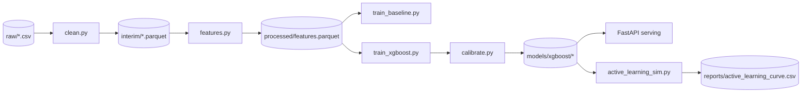
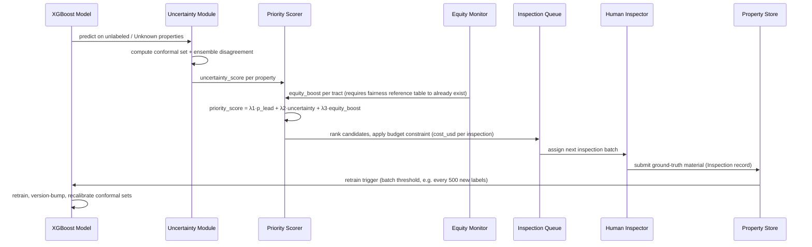

# LeadGuard — System Architecture Document

**Version:** 1.0
**Date:** August 20, 2026
**Status:** Approved for build
**Companion document:** `LeadGuard_Agent_Implementation_Spec.md` (execution instructions for a coding agent)
**Derived from:** Original LeadGuard project proposal (problem framing, ML approach, resource constraints)

---

## 1. Purpose & Scope

The source proposal makes a strong case for *what* to build and *why*. This document exists to answer the questions a builder hits immediately after: what exactly does each component read and write, what does the data look like, what does the API return, and what happens when two vague requirements (like "prioritize by risk" and "prioritize equitably") pull in different directions.

This document is the single source of truth for system design. It does not repeat the interview-prep material, resume bullets, or demo script from the source proposal — those remain valid as written and live outside this document's scope. It **does** formalize every place the original design left an implementation detail undefined.

---

## 2. Analysis Summary — What Changed From the Original Proposal

| # | Area | Gap in the original proposal | Resolution in this architecture |
|---|------|------------------------------|----------------------------------|
| 1 | Priority formula | `priority_score = α·P(lead) + β·uncertainty + γ·equity_weight` — `equity_weight` was named but never defined | Formalized as a computable `equity_boost` term tied to tract-level inspection coverage vs. model-estimated risk share (§7.4) |
| 2 | Data contracts | No canonical schema; scripts implied fields by name only | Three canonical entities defined with explicit types and nullability (§6.2) |
| 3 | Pipeline I/O | Stage scripts (`clean.py`, `features.py`, …) named without defined inputs/outputs | Stage-by-stage contract table, one row per script (§6.4) |
| 4 | API surface | Implied by "FastAPI (Batch Predict)" with no endpoints listed | Full endpoint table with request/response shapes (§8) |
| 5 | Regulatory framing | Stated the EPA inventory deadline as "by 2024," phrased as upcoming | Updated to current status: that deadline passed; the active deadline is now the Nov 1, 2027 LCRI replacement-plan milestone (§3), which strengthens rather than weakens the case for the project |
| 6 | Fairness vs. active learning ordering | Presented as concurrent Week 5 work | Sequenced explicitly — equity accounting must exist before the active learning scorer can use it (§7.4–7.5, and enforced as a phase dependency in the companion spec) |
| 7 | Conformal method | Named generically as "Vovk's method" | Specified: split conformal for global coverage, Mondrian (group-conditional) conformal per income quartile for fairness-aware coverage (§7.3) |
| 8 | Persistence on free hosting | Noted "no persistent storage" as an unresolved limitation | Defined pattern: read-only bundled snapshot + optional HF persistent storage add-on, documented explicitly as out of the $0 baseline (§9) |
| 9 | Demographic data usage | Correctly said census data is "for fairness analysis only," but didn't specify how that boundary is enforced in code | Made explicit as a design rule: protected-class-correlated fields never enter the feature matrix; they are joined only in the fairness-audit path (§7.4, §10) |

---

## 3. Problem Context (current as of this document's date)

The original proposal's urgency argument was correct in kind but stale in specifics. The corrected picture, as of the most recent public reporting available:

- EPA's 2021 Lead and Copper Rule Revisions (LCRR) set an initial service-line-inventory deadline of **October 16, 2024**. That deadline has passed — inventories are supposed to already exist.
- EPA's 2024 Lead and Copper Rule Improvements (LCRI) superseded parts of the LCRR. The next binding milestone is **November 1, 2027**, by which systems must have an approved replacement plan and an updated inventory, with full replacement generally required within about a decade of the rule for most systems.
- Chicago — the proposal's primary target city — carries more than **412,000** confirmed or suspected lead service lines. At its 2025–2026 replacement pace (roughly 7,000–10,000 lines/year), the city's own submitted schedule doesn't clear the backlog until **2076**.
- Chicago was also required to notify ~900,000 households of potential risk; public reporting from mid-to-late 2025 indicated only a small fraction of that list had been notified at the time.

**Implication for this project:** the "find the pipes" phase is technically over — cities are supposed to already know. What they're actually short on is the ability to sequence hundreds of thousands of remaining "unknown" or unreplaced properties under real budget, workforce, and equity constraints. That is a sequencing and prioritization problem, which is exactly what LeadGuard is built to solve. This makes the project's value proposition *stronger* than the original framing, not weaker — it targets the active bottleneck, not a deadline that's already passed.

*Sources: US EPA (epa.gov/dwreginfo/lead-and-copper-rule, epa.gov Program Overview pages on LCRI compliance); Inside Climate News, WBEZ, and WTTW investigative reporting on Chicago's replacement pace (Sept–Oct 2025).*

---

## 4. System Summary

LeadGuard is a CPU-first, $0-infrastructure system that:

1. Predicts service-line material for properties lacking a confirmed record.
2. Attaches a calibrated uncertainty estimate to every prediction, not just a point probability.
3. Converts predictions + uncertainty + equity standing into a ranked inspection queue under a budget constraint.
4. Feeds real inspection outcomes back into the model (active learning), improving it where it's most uncertain rather than where it's most convenient.
5. Explains every served prediction in plain-language, feature-level terms.
6. Continuously audits itself for disparate impact across income groups, without using protected-class-correlated data as a model input.

---

## 5. Design Principles & Hard Constraints

| Principle | Concrete implication |
|---|---|
| $0 infrastructure | No paid APIs, no paid cloud compute, no paid databases. Every dependency in §14 has a free tier or OSS license that covers this use. |
| CPU-first | XGBoost is the primary and only *required* model family. GPU (RTX 4060) is optional, used only for ablation studies (e.g., TabNet comparison), never on the critical path. |
| Local-first development | Full pipeline must run end-to-end on a single laptop (16GB RAM) using a sampled dataset before any cloud step is touched. |
| Public data only | No private, licensed, or scraped-behind-auth data sources. Every field in the canonical schema traces to a named public dataset (§6.1). |
| Fairness by construction, not audit-only | Protected-class-correlated fields (income, race) are never part of the feature matrix used for prediction. They enter **only** the fairness-audit path (§10) and the geography-based equity term (§7.4), which uses tract identifiers, not demographic values, as its input. |
| Explainability is mandatory, not optional | Every prediction served through the API carries a SHAP-based explanation. There is no "explain later" mode. |
| Human-in-the-loop | The system recommends and ranks; it never auto-dispatches a physical inspection. A human always confirms the queue before work is assigned. |

---

## 6. Data Architecture

### 6.1 Data Sources

| Source | Fields used | License | Update cadence | Access |
|---|---|---|---|---|
| Chicago Water Service Line Inventory | Address, ZIP, Ward, property type, service line material, lat/long | Public domain (CC0) | Rolling, city-updated | Chicago Data Portal bulk CSV export |
| Cook County Property Assessor | Year built, property class, lot size, building sq ft, stories, basement flag | Open Data | Annual reassessment cycle | Cook County Open Data bulk export |
| OpenStreetMap (Geofabrik, Chicago metro extract) | Fire hydrant points, building footprints, road class | ODbL | On-demand extract | Geofabrik `.pbf` download |
| US Census ACS (5-year estimates, tract level) | Median household income → income quartile | Public | Annual | Census API or bulk download |

**Explicit rule:** the ACS join happens on a separate table (`fairness_reference.parquet`) keyed by census tract, never merged into the property feature table used for training or inference. This is what makes "never used as a predictive feature" enforceable rather than aspirational.

### 6.2 Canonical Entities

**`Property`** — one row per service line address.

| Field | Type | Nullable | Notes |
|---|---|---|---|
| `property_id` | string | no | Deterministic hash of normalized address + PIN |
| `address` | string | no | |
| `zip_code` | string | no | |
| `ward` | int | no | Used for geographic holdout splits |
| `latitude`, `longitude` | float | no | |
| `year_built` | int | yes | Primary heuristic signal; missing for ~5–10% of records |
| `property_class` | categorical | yes | |
| `lot_size_sqft`, `building_sqft` | float | yes | |
| `stories` | int | yes | |
| `has_basement` | bool | yes | |
| `h3_index_res8`, `h3_index_res9` | string | no | Computed, not sourced |
| `dist_to_nearest_hydrant_m` | float | no | Computed from OSM |
| `dist_to_nearest_known_lead_m` | float | no | Computed from labeled subset |
| `neighbor_lead_rate_h3res8` | float | no | Spatial lag feature, computed from training data only (leakage-guarded, §6.4) |
| `knn10_lead_rate` | float | no | Same leakage guard applies |
| `census_tract` | string | no | Join key only — **never** used as a model feature directly |
| `service_line_material` | categorical: `Lead / Copper / Galvanized / Unknown` | yes | Training label where known |
| `material_source` | categorical: `inspected / self_reported / unknown` | no | Drives sample weighting for the `Unknown` problem (§7.1) |
| `last_updated` | timestamp | no | |

**`Prediction`** — one row per model output, versioned.

| Field | Type | Notes |
|---|---|---|
| `prediction_id` | string | |
| `property_id` | string | FK to `Property` |
| `model_version` | string | Git SHA or semantic version of the model artifact |
| `p_lead_calibrated` | float [0,1] | Platt-scaled probability |
| `conformal_set` | list[string] | e.g. `["Lead", "Galvanized"]` — materials not ruled out at the configured confidence level |
| `confidence_level` | float | Default `0.90` |
| `uncertainty_score` | float [0,1] | Normalized conformal set size, cross-checked against ensemble disagreement (§7.3) |
| `priority_score` | float [0,1] | Composite score, formula in §7.4 |
| `shap_top_features` | list[{feature, contribution}] | Top 5 by absolute SHAP value |
| `predicted_at` | timestamp | |

**`Inspection`** — one row per physical inspection result, the feedback-loop record.

| Field | Type | Notes |
|---|---|---|
| `inspection_id` | string | |
| `property_id` | string | FK to `Property` |
| `inspected_material` | categorical | Ground truth |
| `inspected_at` | timestamp | |
| `source` | categorical: `field_inspection / self_report_verified` | |
| `cost_usd` | float | Used for the budget-constrained queue and cost-curve evaluation |
| `used_in_training` | bool | Set `true` once folded into a retrain |

### 6.3 Storage Layout

```
data/
├── raw/                     # untouched downloads (gitignored)
├── interim/                 # cleaned, validated, still 1:1 with source rows (gitignored)
├── processed/
│   └── features.parquet     # canonical Property table, ready for training/inference
├── fairness_reference.parquet  # census_tract -> income_quartile, kept separate (see 6.1)
└── sample/                  # 5–10k row de-identified sample, committed to git for CI + demo

models/
├── baseline/                # logistic regression + random forest artifacts
└── xgboost/
    ├── model.json
    ├── conformal_global.pkl
    ├── conformal_by_quartile.pkl
    └── metrics.json

reports/
├── active_learning_curve.csv
├── fairness_report.json
└── shap_summary.png
```

Format choices: Parquet over CSV everywhere after the raw layer (columnar, ~10× smaller, preserves dtypes). `float32` not `float64` for all continuous features. Categorical dtype for ZIP/ward/H3 index.

### 6.4 Pipeline Stage Contracts



| Stage | Script | Reads | Writes | Notes |
|---|---|---|---|---|
| Download | `data/download.py` | Remote sources (§6.1) | `data/raw/*.csv` | Idempotent; skips re-download if checksum matches |
| Clean | `data/clean.py` | `data/raw/*.csv` | `data/interim/*.parquet` | Deduplicates on `property_id`; validates against a Pandera schema before writing |
| Feature engineering | `data/features.py` | `data/interim/*.parquet` | `data/processed/features.parquet` | Spatial-lag and KNN features computed **only from the training partition** to prevent leakage — this must be re-derived per fold during CV, not computed once globally |
| Baseline training | `models/baseline.py` | `features.parquet` | `models/baseline/*` | Logistic regression + random forest |
| Advanced training | `models/xgboost_model.py` | `features.parquet` | `models/xgboost/model.json`, `metrics.json` | Monotonic constraint on `year_built` |
| Calibration | `models/uncertainty.py` | trained model + held-out calibration split | `conformal_global.pkl`, `conformal_by_quartile.pkl` | Never touches the test split |
| Fairness audit | `evaluation/fairness.py` | predictions + `fairness_reference.parquet` | `reports/fairness_report.json` | Read-only join; does not feed back into features |
| Active learning sim | `models/active_learning.py` | model + fairness reference | `reports/active_learning_curve.csv` | Requires fairness reference to exist first — see dependency note in §7.5 |
| Explainability | `evaluation/explainability.py` | trained model + sample | `reports/shap_summary.png` | |

---

## 7. ML Pipeline Architecture

### 7.1 Handling the `Unknown` Label

`Unknown` in `service_line_material` is not a fourth class in the honest sense — it usually means "nobody checked," not "confirmed non-lead." Treat it as a missing label, not a class:
- Exclude `Unknown` rows from the training target.
- Retain them in the spatial-lag computation (their *other* features still inform neighbors) but down-weight their influence via `material_source`.
- Report the `Unknown` count as its own tracked metric — this is the pool active learning is meant to shrink.

### 7.2 Model Design

| Tier | Model | Key settings |
|---|---|---|
| Baseline 0 | Year-built heuristic | `year_built < 1950 → Lead` |
| Baseline 1 | Logistic regression | L2, `C=1.0`, standardized inputs |
| Baseline 2 | Random forest | scikit-learn defaults, 300 estimators |
| Advanced | XGBoost | `max_depth=6`, `learning_rate=0.05`, `n_estimators=500`, `early_stopping_rounds=30`, `scale_pos_weight` computed from class ratio, monotonic constraint `+1` on `year_built` (older → higher lead probability), Optuna search over depth/learning-rate/subsample, 100 trials / 60 min budget |

**Success gate:** advanced model must beat the random-forest baseline by **>10% relative PR-AUC** on the geographic holdout, not the random split (see §7.6).

### 7.3 Uncertainty Quantification

Two complementary methods, not one:

1. **Split conformal prediction** (global): calibrated on a held-out 20% split, target coverage 90% (miscoverage `α = 0.10`). Output is a prediction *set* (e.g., `{Lead, Galvanized}`), not a single label — this is what gets shown to inspectors as "still ambiguous between these materials," which is more honest than a point estimate.
2. **Mondrian (group-conditional) conformal**: the same procedure calibrated separately per income quartile. This exists specifically so coverage guarantees hold *within* each group, not just on average — a global 90%-coverage guarantee can silently mean 98% coverage in wealthy tracts and 80% in poor ones if you don't check.

`uncertainty_score` is derived from conformal set size: `(|set| - 1) / (K - 1)` where `K` is the number of possible materials, normalized to [0,1]. Cross-validate this against 5-seed ensemble disagreement (standard deviation of `p_lead` across seeds) as a sanity check — if the Pearson correlation between the two signals drops below 0.6, treat it as a calibration bug, not a modeling nuance.

### 7.4 Priority Scoring & the Equity Term (formalized)

This is the term the original proposal left undefined. Formal definition:

```
priority_score(p) = λ1 · p_lead_calibrated(p) + λ2 · uncertainty_score(p) + λ3 · equity_boost(tract(p))

defaults: λ1 = 0.60, λ2 = 0.25, λ3 = 0.15   (λ1+λ2+λ3 = 1, configurable in configs/scoring.yaml)
```

`equity_boost(tract)` corrects for a specific, real failure mode: uncertainty- and risk-driven ranking alone will concentrate inspections in whichever neighborhoods happen to have the oldest, most ambiguous records — which correlates with, but is not identical to, the neighborhoods that most need attention. Rather than pull in demographic data directly, the correction compares **model-estimated risk share** to **actual inspection share**, both computed from geography:

```
target_share(tract)  = Σ p_lead_calibrated over properties in tract  /  Σ p_lead_calibrated citywide
actual_share(tract)  = inspections conducted in tract to date  /  total inspections to date

equity_boost(tract) = clip( (target_share(tract) − actual_share(tract)) / max(target_share(tract), 1e-6),  0,  1 )
```

A tract that has received *fewer* inspections than its estimated risk share warrants gets a boost; a tract that's already over-inspected relative to its risk share gets zero boost, never a penalty (this avoids actively steering *away* from any neighborhood). Note what this deliberately does **not** do: it does not take race or income as an input. Income quartile is computed downstream, purely to *audit* whether this geography-based correction is actually working (§10) — it never feeds the score itself. That separation is the enforceable version of "for fairness analysis only" from the original proposal.

### 7.5 Active Learning Loop



**Dependency note (also enforced in the companion implementation spec):** the equity monitor requires `fairness_reference.parquet` and tract-level target/actual share tables to exist *before* the active learning simulation can run — the fairness component is a precondition here, not concurrent work, contrary to how the original 8-week plan grouped them into the same week.

### 7.6 Evaluation Strategy

| Category | Metric | Threshold / rule |
|---|---|---|
| Primary | PR-AUC | Advanced model >10% relative improvement over RF baseline |
| Secondary | ROC-AUC, F2 (β=2, recall-weighted) | Reported, not gating |
| Calibration | Brier score, reliability diagram | Reported per model version |
| Cost-sensitive | Precision@Budget, inspection efficiency | Reported against $100K/$500K/$1M budget scenarios |
| Split validity | Geographic holdout (entire wards excluded from training) vs. random split | Random-split score must not exceed geographic-split score by >15% relative — a larger gap signals spatial leakage |
| Fairness | False-negative-rate disparity across income quartiles | Flag if max disparity >5 percentage points; this does **not** block model release but must be reported alongside every release |

---

## 8. API Design

FastAPI service, versioned under `/v1`.

| Method | Path | Purpose |
|---|---|---|
| `GET` | `/v1/health` | Liveness/readiness check |
| `POST` | `/v1/predict` | Batch predict for a list of `property_id`s or raw property records |
| `GET` | `/v1/properties/{property_id}/prediction` | Single prediction with full SHAP explanation |
| `GET` | `/v1/priority-queue?budget_usd=&limit=` | Ranked inspection queue under a budget constraint |
| `POST` | `/v1/inspections` | Submit a new ground-truth inspection result (feedback loop) |
| `GET` | `/v1/fairness-report` | Latest fairness audit (§7.6 metrics) |
| `GET` | `/v1/model/metadata` | Active model version, training date, headline metrics |

**Example — `POST /v1/predict` request:**
```json
{ "property_ids": ["chi-0341829", "chi-0341830"] }
```

**Example — response:**
```json
{
  "predictions": [
    {
      "property_id": "chi-0341829",
      "p_lead_calibrated": 0.87,
      "conformal_set": ["Lead"],
      "confidence_level": 0.90,
      "uncertainty_score": 0.12,
      "priority_score": 0.81,
      "shap_top_features": [
        {"feature": "year_built", "contribution": 0.35},
        {"feature": "lot_size_sqft", "contribution": 0.20},
        {"feature": "dist_to_nearest_known_lead_m", "contribution": 0.15}
      ],
      "model_version": "xgb-2026.08.1"
    }
  ]
}
```

**Error convention:** standard HTTP status codes (`404` unknown property, `422` malformed request, `503` model not loaded). Every error body includes `{"error": "...", "detail": "..."}` — no bare stack traces returned to callers.

---

## 9. Deployment Architecture

| Environment | Purpose | Hardware | Persistence |
|---|---|---|---|
| Local dev | Full pipeline, iteration | Dev laptop (i7-14650HX, 16GB RAM, RTX 4060 optional) | Local filesystem |
| CI (GitHub Actions) | Tests, lint, smoke-train on sample data | Free 2,000 min/month runner | None — ephemeral |
| Demo (Hugging Face Spaces, free CPU Basic) | Public portfolio demo | 2 vCPU, 16GB RAM, 50GB **non-persistent** disk, sleeps after 48h idle | See below |

**Persistence pattern for the free-tier demo:** the Space ships with the committed `data/sample/` snapshot and a pre-trained model baked into the Docker image, so a cold start needs no external fetch. New `Inspection` submissions made against the public demo are held in memory for the session and are **not** guaranteed to survive a sleep cycle — the demo explicitly is a read-mostly showcase, not a production system. If persistent demo state becomes a requirement later, the upgrade path is HF's paid persistent storage add-on; that is out of scope for the $0 baseline and should be called out as a known limitation in the README, not silently assumed away.

**Config & secrets:** `pydantic` `BaseSettings` reading from `.env` (git-ignored) with `.env.example` committed. The only external credential the system optionally uses is a Census API key (free, non-sensitive) for ACS refreshes — everything else is anonymous public data or bundled.

---

## 10. Non-Functional Requirements

| Category | Requirement | How verified |
|---|---|---|
| Performance | Single prediction p95 < 150ms; batch of 10K properties < 5s | Load test script in `tests/perf/` |
| Reliability | API returns a clear 503 (not a crash) if model artifacts fail to load | Startup smoke test |
| Security | No secrets in git history; dependency vulnerability scan in CI | `git-secrets` pre-commit hook, `pip-audit` in CI |
| Privacy | Addresses never returned in aggregate/public-facing endpoints without explicit `property_id` lookup; public dashboard aggregates to H3 cell, not address | Manual review checklist before each deploy |
| Fairness | Protected-class-correlated fields never present in the training feature matrix | Automated column-name assertion test (`test_no_demographic_leakage`) |
| Observability | Structured logs (not `print`) for every pipeline stage and API request; no PII in logs | Log schema validated in tests |
| Maintainability | >80% test coverage on `src/`; every public function has a docstring | `pytest --cov` gate in CI |

---

## 11. Technology Stack

| Layer | Tool | License | Rationale |
|---|---|---|---|
| Language | Python 3.11 | PSF | |
| Data processing | Polars (primary), pandas (interop) | MIT / BSD | Polars for speed on the full 400K-row join; pandas where library interop demands it |
| ML — advanced | XGBoost | Apache 2.0 | CPU-native, monotonic constraints, fast |
| ML — baseline | scikit-learn | BSD | |
| Hyperparameter search | Optuna | MIT | |
| Geospatial | h3-py, GeoPandas | Apache 2.0 | |
| Uncertainty | MAPIE | BSD | Split + Mondrian conformal out of the box |
| Explainability | SHAP | MIT | |
| Data validation | Pandera | MIT | Schema enforcement at every pipeline boundary (§6.4) |
| API | FastAPI + Pydantic | MIT | |
| Dashboard | Streamlit | Apache 2.0 | |
| Config | pydantic-settings + YAML | MIT | |
| Testing | pytest, pytest-cov | MIT | |
| CI/CD | GitHub Actions | Free tier | |
| Deployment | Hugging Face Spaces (CPU Basic, free) | Free tier | 2 vCPU / 16GB RAM / 50GB non-persistent, confirmed current as of this document's date |

No paid services anywhere in this table.

---

## 12. Repository Structure

```
leadguard/
├── README.md
├── LICENSE                       # MIT
├── pyproject.toml
├── Makefile
├── .env.example
├── .github/workflows/ci.yml
├── configs/
│   ├── train.yaml
│   ├── features.yaml
│   └── scoring.yaml               # λ1/λ2/λ3, confidence_level, budget defaults
├── data/                          # see §6.3
├── src/leadguard/
│   ├── data/         {download,clean,features,validation}.py
│   ├── models/       {baseline,xgboost_model,uncertainty,active_learning}.py
│   ├── evaluation/   {metrics,fairness,explainability}.py
│   └── utils/        geospatial.py
├── api/               {main,schemas,model_loader}.py
├── app/               streamlit_app.py
├── notebooks/          01_eda … 06_error_analysis.ipynb
├── tests/              unit/, integration/, perf/
├── models/             (gitignored, except sample-trained demo artifact)
├── reports/
└── docs/               architecture.md (this doc, mirrored), methodology.md
```

---

## 13. Risk Register

| Risk | Category | Likelihood | Impact | Mitigation |
|---|---|---|---|---|
| Spatial autocorrelation leakage inflates offline metrics | Technical | High | High | Mandatory geographic holdout; gap check in §7.6 |
| `Unknown` labels are silently treated as "not lead" | Technical / Ethical | Medium | High | Excluded from target, tracked as its own metric (§7.1) |
| Equity term becomes a proxy for race/income despite intent | Ethical / Legal | Low–Medium | High | Geography-and-coverage-only input, race/income confined to audit path, automated leakage test (§10) |
| Demo looks broken after 48h idle (HF free-tier sleep) | Operational | High | Low | Documented cold-start behavior, ~10s wake time, sample data bundled so first load needs no network fetch |
| Model doesn't generalize beyond Chicago | Technical | High | Medium | Explicit non-goal for v1; documented as a limitation, not silently implied |
| Cities' own "Unknown"/self-reported data is wrong | Data quality | Medium | High | `material_source` field + sample weighting (§7.1); conformal sets communicate residual doubt instead of hiding it |
| Active learning queue drifts away from real budget constraints | Product | Medium | Medium | `cost_usd` is a first-class field in `Inspection` and a required parameter on `/priority-queue` |

---

## 14. Glossary

- **PR-AUC** — Area under the precision-recall curve; preferred over ROC-AUC under class imbalance.
- **Conformal prediction** — A calibration technique that produces prediction *sets* with a guaranteed coverage rate, rather than a single point estimate.
- **Mondrian conformal prediction** — Conformal prediction calibrated separately within subgroups, so the coverage guarantee holds per-group, not just on average.
- **H3** — Uber's hexagonal hierarchical geospatial indexing system; used here for equal-area spatial aggregation.
- **SHAP** — Shapley Additive Explanations; attributes a model's output to individual input features.
- **LCRR / LCRI** — EPA's Lead and Copper Rule Revisions (2021) and Lead and Copper Rule Improvements (2024), the governing federal regulations.

---

## 15. References

- US EPA, Lead and Copper Rule Improvements — epa.gov/dwreginfo/lead-and-copper-rule
- US EPA, Revised Lead and Copper Rule — epa.gov/ground-water-and-drinking-water/revised-lead-and-copper-rule
- Inside Climate News / WBEZ / Grist investigation, Chicago lead service line replacement pace (Sept 2025)
- WTTW News, Chicago City Council lead service line hearings (Sept–Oct 2025)
- Hugging Face Docs, Spaces Overview and Spaces GPU/sleep-time documentation

---

## 16. Change Log

| Version | Date | Change |
|---|---|---|
| 1.0 | 2026-08-20 | Initial architecture, formalized from source proposal; regulatory context and deployment-tier specs refreshed against current sources |
